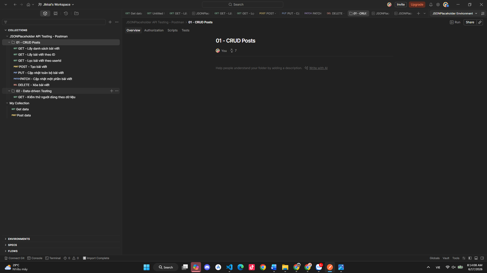
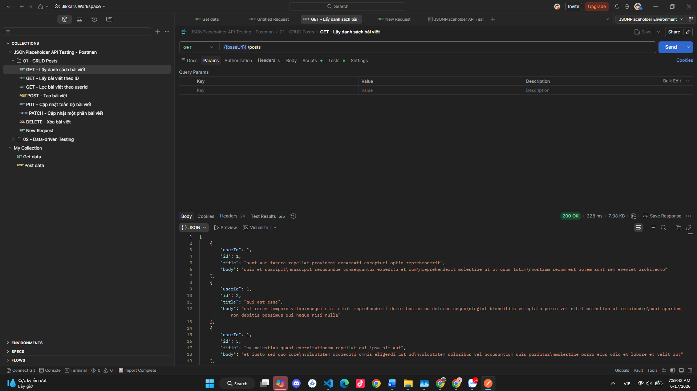
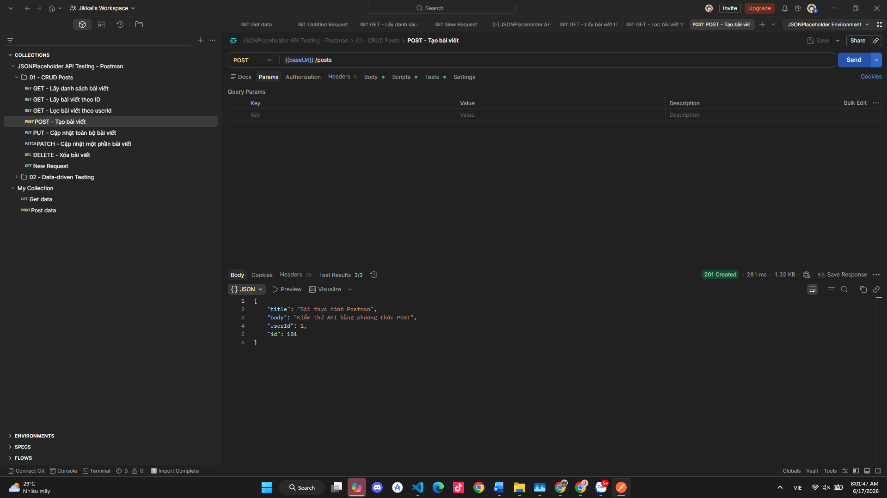
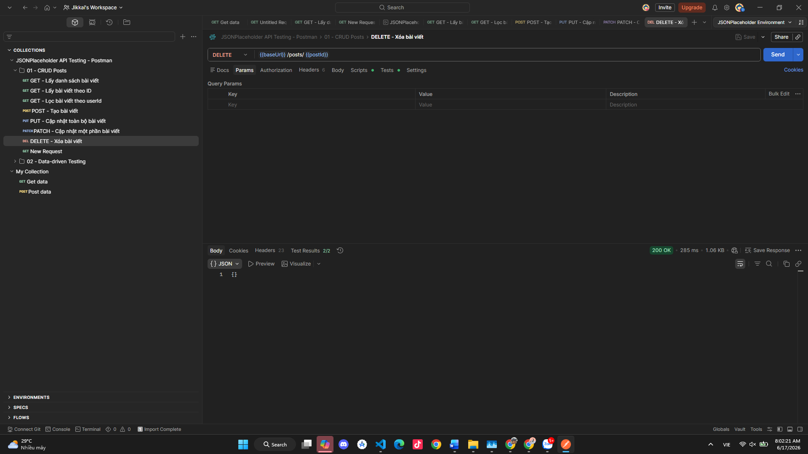
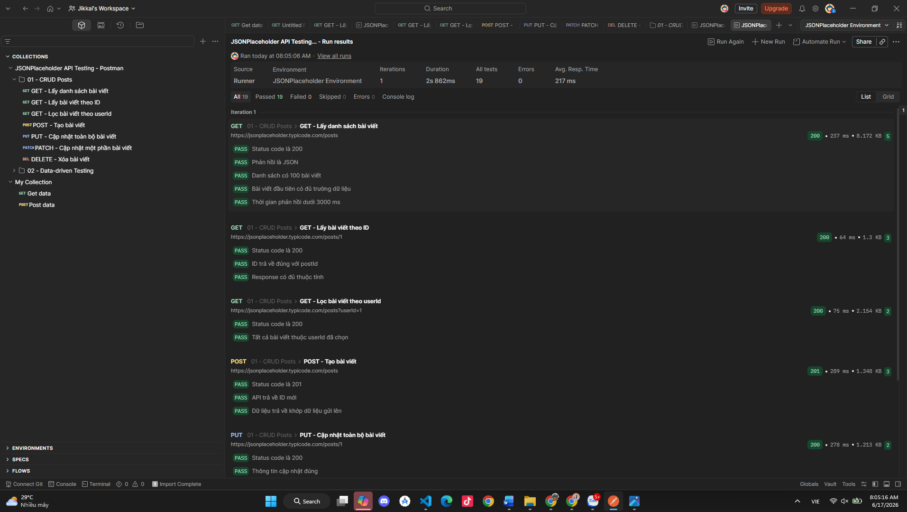
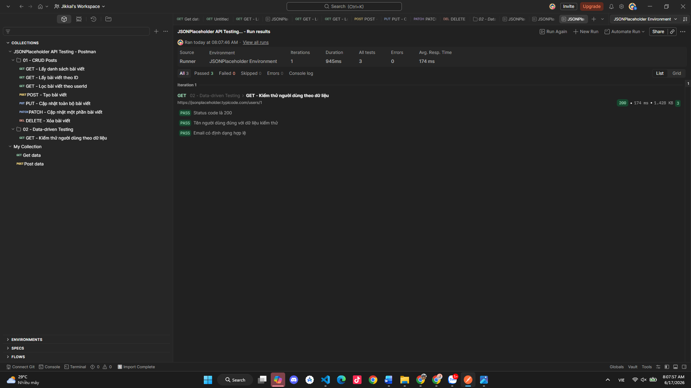

# BÁO CÁO THỰC HÀNH KIỂM THỬ API BẰNG POSTMAN

## 1. Thông tin sinh viên

- **Họ và tên:** Nguyễn Bá Huy
- **Mã sinh viên:** 23010806
- **Lớp:** K17-CNTT8
- **Môn học:** Kiểm thử phần mềm
- **Chủ đề:** Thực hành kiểm thử REST API bằng Postman

## 2. Mục tiêu bài thực hành

Bài thực hành được thực hiện nhằm:

- Làm quen với giao diện và các thành phần cơ bản của Postman.
- Gửi request bằng các phương thức HTTP: `GET`, `POST`, `PUT`, `PATCH`, `DELETE`.
- Sử dụng biến môi trường để tái sử dụng URL và dữ liệu.
- Viết test script kiểm tra status code, cấu trúc JSON, dữ liệu trả về và thời gian phản hồi.
- Chạy toàn bộ test bằng Collection Runner.
- Thực hiện kiểm thử hướng dữ liệu (data-driven testing).

## 3. Công cụ và tài liệu

### 3.1. Công cụ

- Postman Desktop hoặc Postman Web.
- Git và GitHub.
- API kiểm thử: JSONPlaceholder.

### 3.2. Tài liệu tham khảo

- Video được giao: https://www.youtube.com/watch?v=MFxk5BZulVU
- Postman Learning Center: https://learning.postman.com/docs/
- JSONPlaceholder Guide: https://jsonplaceholder.typicode.com/guide/

## 4. API được sử dụng

JSONPlaceholder là REST API công khai dùng cho học tập, kiểm thử và tạo mẫu. API hỗ trợ các phương thức HTTP phổ biến. Các thao tác tạo, sửa và xóa được mô phỏng, không làm thay đổi dữ liệu thật trên máy chủ.

Base URL:

```text
https://jsonplaceholder.typicode.com
```

## 5. Cấu trúc repository

```text
├── postman/
│   ├── JSONPlaceholder_API_Testing.postman_collection.json
│   └── JSONPlaceholder_Environment.postman_environment.json
├── screenshots/
└── README.md
```

## 6. Hướng dẫn import vào Postman

1. Mở Postman và chọn **Import**.
2. Import file:

   ```text
   postman/JSONPlaceholder_API_Testing.postman_collection.json
   ```

3. Tiếp tục import file:

   ```text
   postman/JSONPlaceholder_Environment.postman_environment.json
   ```

4. Chọn environment **JSONPlaceholder Environment** ở góc trên bên phải.
5. Mở collection và gửi lần lượt từng request.

### Hình 1. Import Collection và Environment

> Thay file `screenshots/01-import-collection.svg` bằng ảnh chụp thật, giữ nguyên tên file hoặc sửa đường dẫn bên dưới.



## 7. Biến môi trường

| Biến | Giá trị | Ý nghĩa |
|---|---|---|
| `baseUrl` | `https://jsonplaceholder.typicode.com` | Địa chỉ gốc của API |
| `postId` | `1` | ID bài viết dùng cho GET, PUT, PATCH, DELETE |
| `userId` | `1` | ID người dùng |
| `expectedName` | `Leanne Graham` | Kết quả mong đợi khi kiểm thử người dùng |

Ví dụ sử dụng biến:

```text
{{baseUrl}}/posts/{{postId}}
```

### Hình 2. Cấu hình Environment


## 8. Danh sách trường hợp kiểm thử

| STT | Phương thức | Endpoint | Mục đích | Kết quả mong đợi |
|---:|---|---|---|---|
| 1 | GET | `/posts` | Lấy danh sách bài viết | Status `200`, JSON Array, có 100 phần tử |
| 2 | GET | `/posts/{{postId}}` | Lấy bài viết theo ID | Status `200`, ID đúng, đủ trường dữ liệu |
| 3 | GET | `/posts?userId={{userId}}` | Lọc bài viết theo người dùng | Status `200`, tất cả phần tử có đúng `userId` |
| 4 | POST | `/posts` | Tạo bài viết | Status `201`, dữ liệu phản hồi khớp request |
| 5 | PUT | `/posts/{{postId}}` | Cập nhật toàn bộ bài viết | Status `200`, các trường được cập nhật |
| 6 | PATCH | `/posts/{{postId}}` | Cập nhật một phần bài viết | Status `200`, trường `title` thay đổi |
| 7 | DELETE | `/posts/{{postId}}` | Xóa bài viết | Status `200`, response là object rỗng |
| 8 | GET | `/users/{{userId}}` | Kiểm thử theo bộ dữ liệu | Status `200`, tên và email hợp lệ |

## 9. Kết quả thực hiện

### 9.1. Gửi request GET

Request:

```http
GET {{baseUrl}}/posts
```

Các kiểm tra tự động:

- Status code bằng `200`.
- Response là JSON.
- Response là mảng gồm 100 bài viết.
- Bài viết đầu tiên có đủ `userId`, `id`, `title`, `body`.
- Thời gian phản hồi dưới 3000 ms.

### Hình 3. Kết quả GET danh sách bài viết



### 9.2. Gửi request POST

Request:

```http
POST {{baseUrl}}/posts
Content-Type: application/json
```

Body:

```json
{
  "title": "Bài thực hành Postman",
  "body": "Kiểm thử API bằng phương thức POST",
  "userId": 1
}
```

Kết quả mong đợi:

- Status code bằng `201`.
- API trả về ID mới.
- Nội dung trả về khớp với dữ liệu đã gửi.

### Hình 4. Kết quả POST tạo bài viết



### 9.3. Gửi request PUT, PATCH và DELETE

- `PUT` dùng để cập nhật toàn bộ thông tin bài viết.
- `PATCH` dùng để cập nhật một phần thông tin.
- `DELETE` dùng để mô phỏng xóa bài viết.

### Hình 5. Kết quả cập nhật và xóa dữ liệu



## 10. Test script trong Postman

Ví dụ kiểm tra status code:

```javascript
pm.test("Status code là 200", function () {
    pm.response.to.have.status(200);
});
```

Ví dụ kiểm tra dữ liệu JSON:

```javascript
pm.test("Response có đủ thuộc tính", function () {
    const data = pm.response.json();
    pm.expect(data).to.include.all.keys("userId", "id", "title", "body");
});
```

Ví dụ kiểm tra thời gian phản hồi:

```javascript
pm.test("Thời gian phản hồi dưới 3000 ms", function () {
    pm.expect(pm.response.responseTime).to.be.below(3000);
});
```

### Hình 6. Kết quả các test đều Passed



## 11. Chạy Collection Runner

1. Chọn collection **JSONPlaceholder API Testing - Postman**.
2. Nhấn **Run**.
3. Chọn Environment **JSONPlaceholder Environment**.
4. Có thể chạy toàn bộ collection một lần.
5. Để kiểm thử hướng dữ liệu, chọn request trong thư mục **02 - Data-driven Testing**.
6. Tải file dữ liệu:

   ```text
   data/users.json
   ```

7. Nhấn **Run JSONPlaceholder API Testing - Postman**.
8. Kiểm tra số test passed và failed.

### Dữ liệu kiểm thử

```json
[
  {
    "userId": 1,
    "expectedName": "Leanne Graham"
  },
  {
    "userId": 2,
    "expectedName": "Ervin Howell"
  },
  {
    "userId": 3,
    "expectedName": "Clementine Bauch"
  }
]
```

### Hình 7. Kết quả Collection Runner



## 12. Chạy tự động bằng Newman

Newman là công cụ dòng lệnh cho phép chạy Postman Collection.

Cài đặt thư viện:

```bash
npm install
```

Chạy collection:

```bash
npm test
```

Chạy riêng kiểm thử hướng dữ liệu:

```bash
npm run test:data
```

Kết quả JUnit được lưu tại:

```text
reports/junit-report.xml
```

Repository cũng có GitHub Actions để tự động chạy collection mỗi khi có `push` hoặc `pull request`.

## 13. Kết quả đạt được

Sau bài thực hành, sinh viên đã:

- Tạo và tổ chức request trong Postman Collection.
- Hiểu ý nghĩa của các phương thức HTTP cơ bản.
- Sử dụng biến môi trường trong URL.
- Gửi dữ liệu JSON trong request body.
- Viết test script để kiểm tra response.
- Chạy nhiều request bằng Collection Runner.
- Thực hiện data-driven testing bằng tệp JSON.
- Biết cách lưu Collection và Environment lên GitHub.

## 14. Nhận xét

Postman hỗ trợ kiểm thử API trực quan, dễ sử dụng và cho phép tự động hóa nhiều kiểm tra lặp lại. Việc sử dụng Collection, Environment và test script giúp giảm thao tác thủ công, tăng khả năng tái sử dụng và giúp phát hiện lỗi nhanh hơn.

## 15. Kết luận

Bài thực hành đã hoàn thành các nội dung cơ bản của kiểm thử REST API bằng Postman. Các request và test script đều được tổ chức trong Collection để dễ quản lý, thực thi và chia sẻ. Đây là nền tảng để tiếp tục học kiểm thử tích hợp, kiểm thử hồi quy và tự động hóa API trong các dự án thực tế.

---

> **Lưu ý trước khi nộp:** Thay toàn bộ ảnh `.svg` mẫu trong thư mục `screenshots` bằng ảnh chụp thật từ Postman. Có thể lưu ảnh dưới dạng `.png` rồi sửa phần mở rộng trong các đường dẫn ảnh của `README.md`.
